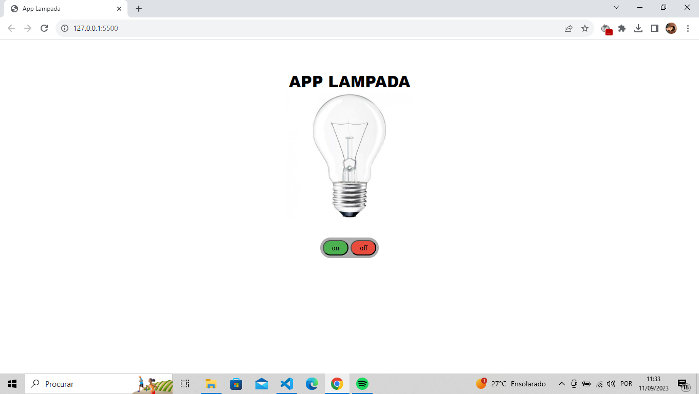
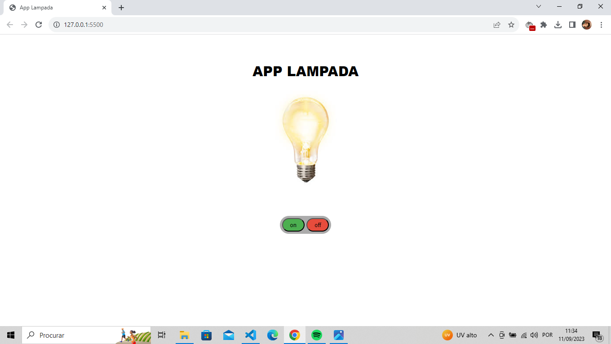
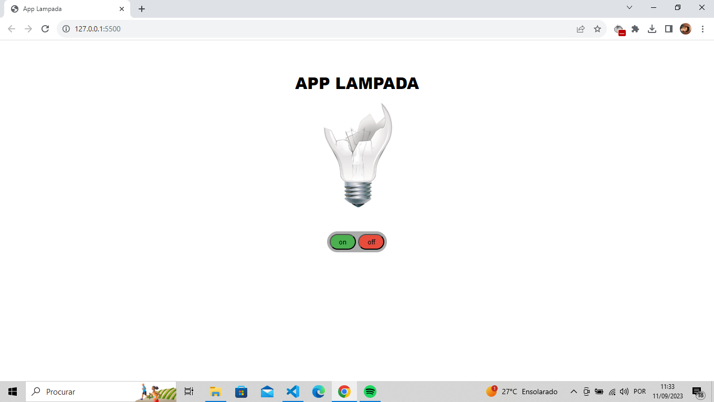

  

  

  

## 🚀 Tecnologias

Esse projeto foi desenvolvido com as seguintes tecnologias:

- HTML e CSS
- JavaScript

## 💻 Projeto

Projeto Simples de uma Lampada que através da manipulação da DOM e ouvindo eventos muda seu estado de acesa e apagada. Com um plus de ao clicar duas vezes ele quebra.
